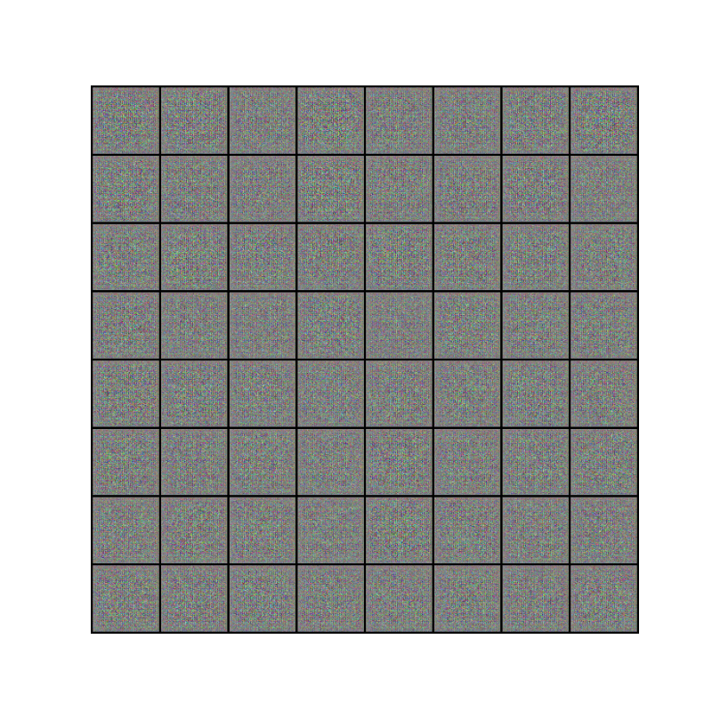
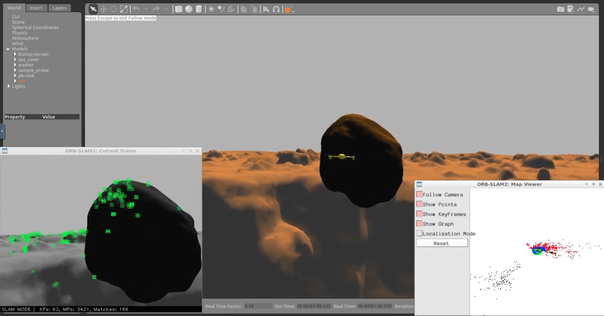

I am an MS Robotics student at Arizona state university. I do research in Computer vision, Machine Learning with focus on Robotics. My masters thesis is in learning based Visual Odometry. My research is driven by a more abstract interest in shape understanding at both the structural and semantic levels.

#### Technical Skills: Python, C++, PyTorch, ROS/ROS2

## Education						       		
- M.S., Robotics	| Arizona State University	 			        		
- B.Tech., Electronics and communication | SRM University

## Work Experience
**Research Assitant @ Active Perception Group (_April 2023 - Present_)**
- Visual odometry using Contrastive Learning: designing a supervised contrastive regression loss for visual pose estimation. Transnational accuracy:0.76 cm. Rotational accuracy:1e-6 radians on KITTI dataset.

**Summer Intern @ HiMER Lab (_October 2022 - July 2023_)**
- Implementation of robot teleoperation through Vertual Reality. This study also includes literature review of psychological factors involving human comfort, transparency, efficient communication and reconfigurability.

## Projects

### Adeversarial generative networks

*Implemented a Deep Convolutional Generative Adversarial Network (DCGAN) model for image generation, showcasing proficiency in deep learning and computer vision.*
[View Code](https://github.com/zeelbhatt/generative_adversarial_networks)

### LQR Controller to balance the inverted pendulmn

*Balancing an inverted pendulum by programming an LQR controller. Design of a controller by checking observabilty matrix, kalman filtering, and finally checking the controllability of the designed system.*
[View Code](https://github.com/zeelbhatt/autonomous-exploration/tree/main/pendulum_control)

### SLAM mission and autonomous landing

*Description: Describe your second project here.*
[View Code](https://github.com/zeelbhatt/autonomous-exploration/tree/main)

