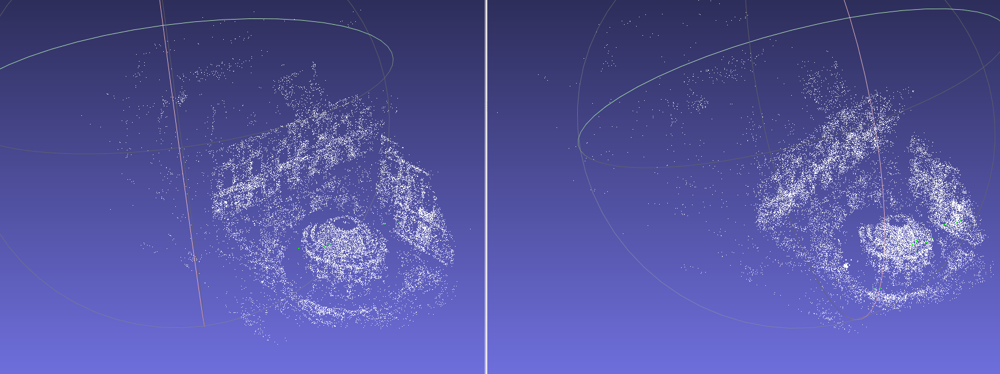

<!-- Default Statcounter code for My Portfolio https://zeelbhatt.github.io/ -->

<noscript>

</noscript>
<!-- End of Statcounter Code -->

I am an MS Robotics from Arizona state university. I do research in machine learning with focus on 3D vision and robotics. My research is driven by a more abstract interest in shape understanding at both the structural and semantic levels. I practice a lots of Chess and a musical instrument. I beleive humans should be immortal.  

#### Technical Skills: C++, CUDA, GTSAM, PyTorch, OpenCV, ROS/ROS2

## Education						       		
- M.S., Robotics	| Arizona State University	 			        		
- B.Tech., Electronics and communication | SRM University

<!-- ## Work Experience
**Researcher @ Active Perception Group (_April 2023 - Present_)**
- Designing un-supervised learning based architechurre for monocular visual odometry on KITTI dataset.

**Summer Intern @ HiMER Lab (_October 2022 - July 2023_)**
- Implementation of robot teleoperation through Vertual Reality. This study also includes literature review of psychological factors involving human comfort, transparency, efficient communication and reconfigurability. -->

## Posts!
### - My MS thesis topic(Visual Odometry via Contrastive Learning) is now on [arxiv](https://arxiv.org/pdf/2507.00243v1)

### - Queen's Gambit Knight sacrifice version !!
#### The one from my games:

<iframe src="https://lichess.org/embed/game/LbpnsHTq?theme=auto&bg=auto"
width=600 height=397 frameborder=0></iframe>

## Work Experience

### Openspace AI | Computer Vision Engineer
Advancing Spatial AI | Building robust SLAM & 3D reconstruction systems | Training 3D foundation models to redefine Spatial intelligence.

### Active Perception Group | Research Assistant 
MS Thesis: Visual odometry using supervised contrastive regression loss for pose estimation (Advisor: Dr. Yezhou Yang)
Achieved 0.76 cm translational and 1e-6 rad rotational accuracy on the KITTI dataset

### Packizon | Computer Vision Intern
Developed an RGBD camera-based, highly accurate  box-dimensioning system
### RRC | Robotics Research Engineer
Autonomous Vehicle: Experiments with COntrol System

### Flytbase | Robotics Engineer 
Robotics Software Development for Drones in ROS | Lots of Computer Vision

## Intersting Projects:

### SLAM mission and autonomous landing

*Crreating a 3D pointmap of a rocky mountain using ORB-SLAM. while autonomously navigating and landing on the mocing rover using optical flow* (Concepts: ORB-SLAM, ROS, Gazebo Simulation, Optical flow)
[View Code](https://github.com/zeelbhatt/autonomous-exploration/tree/main)

### Learning to Localize : Contrastive approach for visual localization 

*A Self-Supervised approach for Learning based Visual Localization. It is a novel use of contrastive loss funtion for finding SE(3) pose of object*
[View Code](https://zeelbhatt.github.io/Learning-from-Motion.github.io/)

### Bundle Adjustment using C++ Ceres Library

[*See blog-post*](https://zeelbhatt.github.io/bundle_adjustment.github.io/)
*I have written a detail article about Camera calinration and bundle Adjustment* [*View Code*](https://github.com/zeelbhatt/bundle_adjustment.github.io)

### Image signal processing

*Implementation of low-pass filter, high-pass filter on the images, Phase swapping of two images*
[See blog-post](https://zeelbhatt.github.io/image-fourier-transform.github.io/)

### Image generation - multiresolution blending 

*Generation of Gaussian pyramid and Laplcian pyramid as a basic encoder decoder model*

### Adeversarial generative networks

*Implemented a Deep Convolutional Generative Adversarial Network (DCGAN) model for image generation as described in [Goodfellow’s paper](https://proceedings.neurips.cc/paper_files/paper/2014/file/5ca3e9b122f61f8f06494c97b1afccf3-Paper.pdf), showcasing proficiency in deep learning and computer vision. (Implementation of Min-Max adversarial loss funtion)*
[View Code](https://github.com/zeelbhatt/generative_adversarial_networks)

### LQR Controller to balance the inverted pendulmn

*Balancing an inverted pendulum by programming an LQR controller. Design of a controller by checking observabilty matrix, kalman filtering, and finally checking the controllability of the designed system.*
[View Code](https://github.com/zeelbhatt/autonomous-exploration/tree/main/pendulum_control)

[View PDF](/images/vocl_proposal.pdf)

## Blog-posts
### Image Fourier Transform

## Publication

IROS 2018 [https://ieeexplore.ieee.org/document/8594129](https://ieeexplore.ieee.org/document/8594129)
M. Harikrishnan Nair, T. Ghanshyam Singh, G. Chourasia, A. Das, A. Shrivastava and Z. S. Bhatt, "Flamen 7 DOF robotic Arm to Manipulate a Spanish Fan," 2018 IEEE/RSJ International Conference on Intelligent Robots and Systems (IROS), 2018, pp. 4152-4157, DOI: 10.1109/IROS.2018.8594129.

[https://ieeexplore.ieee.org/abstract/document/8991313](https://ieeexplore.ieee.org/abstract/document/8991313)
Chourasia, Gunjan, et al. "7-dof robotic manipulator for autonomous segregation using transfer learning." 2019 6th International Conference on Computing for Sustainable Global Development (INDIACom). IEEE, 2019.

